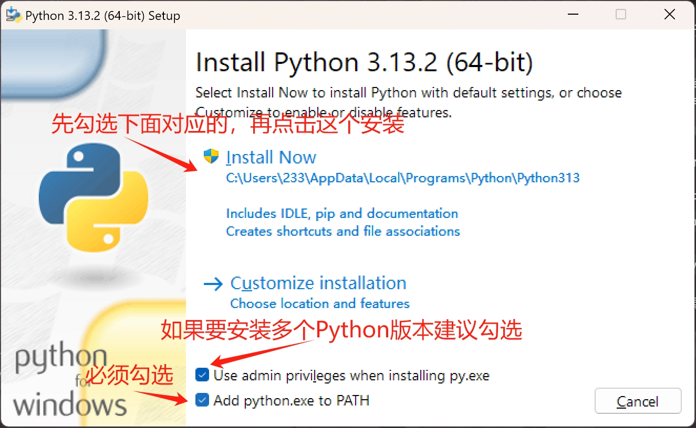
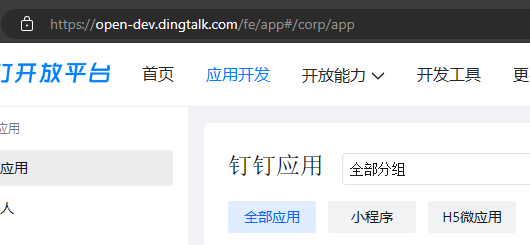
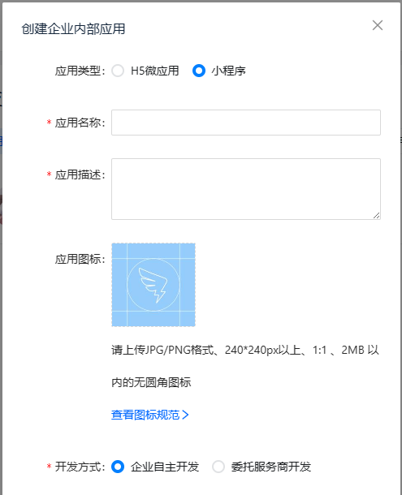
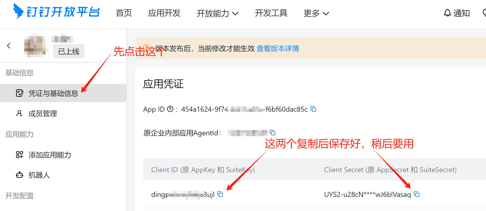
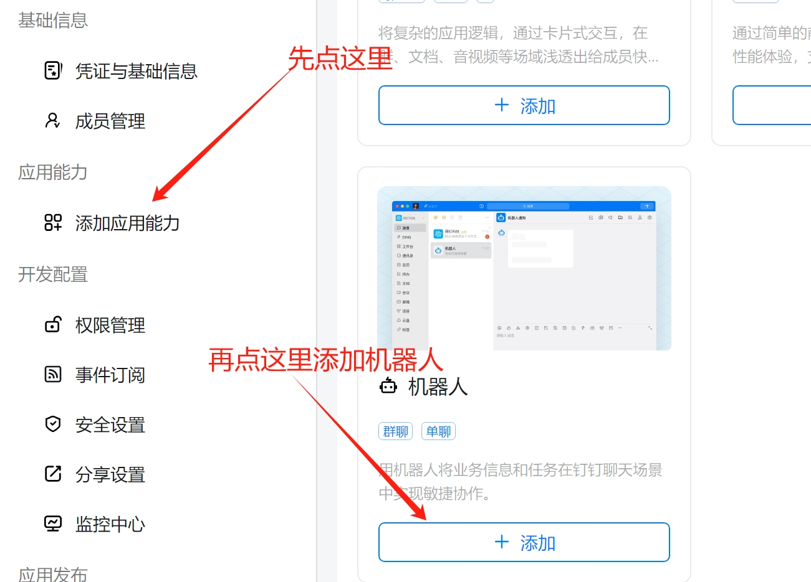
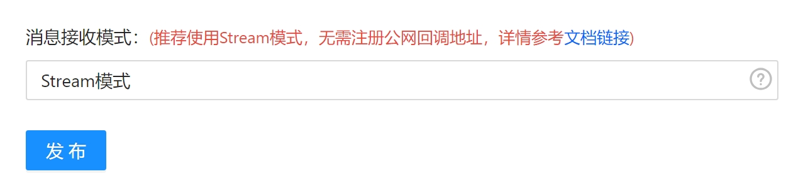
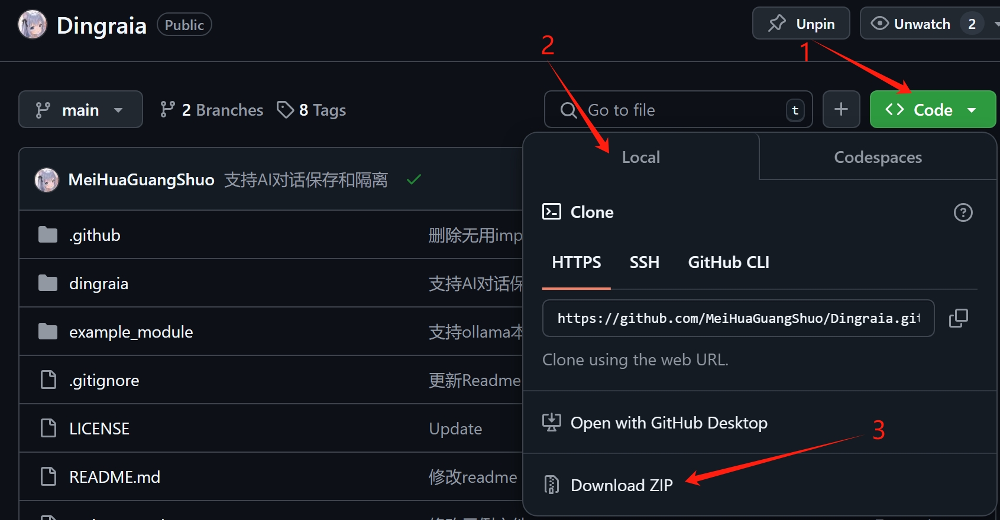

# Stream 连接快速部署教程

### 没有Python

怎么判断？控制台执行下面的命令

```shell
python -V
```

出现类似下方的话代表已经安装，否则没有安装

```text
Python 3.12.4
```

### 如何安装？

#### Linux

执行以下命令

```shell
sudo apt-get update
sudo apt-get install -y python3
```

#### Windows

打开[Python官网下载地址](https://www.python.org/downloads/)，选择类似
`Download Python 3.1x.x`
的黄色按钮，点击下载，或者[点这里](https://www.python.org/ftp/python/3.13.2/python-3.13.2-amd64.exe)
下载 `Python 3.13.2`

下载完成后按照下方点击安装



可能会弹出一个对话框，询问是否解除文件夹长度限制，不懂的点“是”就行

安装完成后，按下 `Win + X` ，Win11选择 “终端”，Win10选择 “PowerShell” 并进入

再次运行以下命令查看是否成功安装

```shell
python -V
```

Linux 用户在今后的所以命令请使用 `python3` 替代 `python`，如

```shell
python3 -V
```

出现 `Python 3.13.2`的时候就代表安装成功了

### 在钉钉平台设置自己的机器人

1.去到[钉钉开发者后台](https://open-dev.dingtalk.com)并登录

2.选择你的组织


**注意：一定确认你的目标群组在哪个组织下，否则无法添加**

3.点击[应用开发](https://open-dev.dingtalk.com/fe/app#/corp/app)



4.根据具体内容填写对应信息



5.找到应用的 `AppKey` 和 `AppSecret` ，保存备用



6.找到这里，创建机器人



7.填写对应项目，消息接收模式选择 `Stream模式`



8.点击发布

> 如果无法在群组机器人中找到你创建的机器人，可以尝试以下方法
>
> 1. 确认群是否在组织内
> 2. 发布应用（新版本要求发布版本后更改生效，直接创建新版本发布即可）

### 克隆本项目

你可以选择下载源代码或者使用 `git clone` 来下载本项目

下载源代码请在页面顶部的绿色 `Code` 按钮选择 `Download ZIP` 按钮下载



下载完成后选择喜欢的位置解压

> 以下命令建议 `Windows` 用户通过 `PowerShell` (推荐版本>=7) ，
> `Linux` 用户直接使用 bash 控制台即可

如果安装了 `git` 客户端可以在终端使用以下命令克隆，记得先cd到要安装的目录

```shell
git clone https://github.com/MeiHuaGuangShuo/Dingraia.git
```

如果配置了 `SSH密钥` ，使用 SSH克隆会更加快速稳定

```shell
git clone git@github.com:MeiHuaGuangShuo/Dingraia.git
```

然后执行以下命令进入文件夹

```shell
cd Dingraia
```

> #### 如果你懒得进行后面的，请使用一键安装脚本 （仅测试Windows）
> Win
> ```shell
> python quickSetup.py
> ```
>
> Linux
> ```shell
> python3 quickSetup.py
> ```
>
> 运行完成后会创建 `start.bat`(Windows) 或 `start.sh`(Linux)
>
> 运行脚本即可启动，然后下面的你都不用看了

然后复制主程序示例并改名为 `main.py`

```shell
cp main_example.py main.py
```

执行完成后，对于 `Windows` 用户，执行以下命令打开文件夹进行图形化界面编辑可能提升编辑效率

```shell
explorer .
```

打开 `main.py`，填入主要参数，由于这里是 Stream 连接教学，所以填入对应即可

找到下列代码

```python
app = Dingtalk(
    Config(bot=Bot('AppKey',
                   'AppSecret',
                   'robotCode'),
           # Bot 参数是一定要填写的
           event_callback=CallBack("AesKey",
                                   "Token",
                                   "CropId"),
           # event_callback 仅为作为 HTTP 模式的时候使用的，Stream模式无需填写，保持原样即可，支持单/多Stream
           stream=[Stream('AppKey1',
                          'AppSecret1')]
           ))
```

`Bot` 里的 `AppKey` 和 `robotCode` 填写钉钉平台提供的 `AppKey`，
`AppSecret` 同理，然后 `Stream` 里的 `AppKey1` 和 `AppSecret1` 同理

完成后保存并退出文件编辑

> #### Linux 用户怎么修改？
>
> 执行以下命令进入编辑
> ```shell
> vim main.py
> ```
>
> 如果报错则执行以下命令安装 `VIM`
> ```shell
> sudo apt-get update
> sudo apt-get install -y vim
> ```
>
> 使用 `↑`、`↓`、`←`、`→` 移动光标到对应位置
>
> 保持输入法为英文，大写未锁定
>
> 按下键盘上的 `I` 键开始编辑
>
> 此时左下角会显示 `-- INSERT --` 或 `-- 插入 --` (已设置中文用户)
>
> 然后填写对应选项
>
> ##### 注意：填写时两侧的单引号不能删除，否则程序会报错
>
> 填写完成后，**先按** `Esc` 退出编辑，再输入 `:` ，是英文状态下的冒号，
> 然后左下角会出现一个 `:` ，证明你输入正确，然后再输入 `wq` ，
> 左下角就出现了 `:wq` ，然后按下 `Enter` 回车，这样就保存成功了

编辑完成开始安装 Python 依赖

> #### 如果你是什么都不会的小白
>
> 说实话，还是学点吧，或者找找 AI ，不然开发一个机器人也是相当麻烦的
>
> 或者，其实你也可以这样，找个人帮你研究一下，不懂的问他，这样开发机器人比较轻松

### 安装 Python 依赖

#### 如果你的 Python 是新装的，而且你认为不会再鼓捣其他的东西了

直接执行下列命令安装依赖即可

```shell
python -m pip install -r requirements.txt
```

Linux 用户请将 `python` 替换为 `python3`

```shell
python3 -m pip install -r requirements.txt
```

#### 如果你已经安装了 Python 且需要和其他软件共存

首先执行

```shell
python -m venv venv
```

Linux 用户自行替换成 `python3`

然后等待执行完成，程序下会出现名为 `venv` 的文件夹

`Windows` 用户执行以下命令激活

```shell
.\venv\Scripts\activate.bat
```

`Linux` 用户执行以下指令激活

```shell
source venv/bin/activate
```

当前面出现了 `(venv)` 代表激活成功

然后进行安装

```shell
python -m pip install -r requirements.txt
```

### 启动程序

安装完成后，执行以下命令启动程序

```shell
python main.py
```

当你在最下面看到 `SUCCESS` 的绿色消息代表你启动成功了
